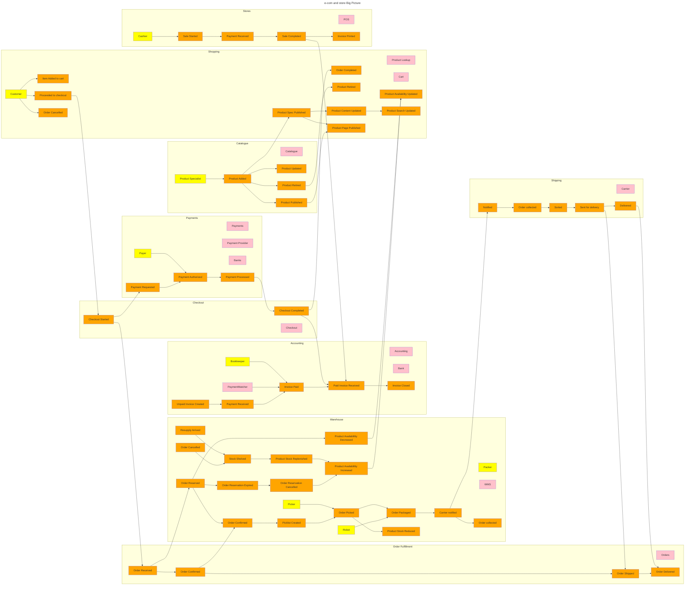

```mermaid
---
title: e-com and store Big Picture
---
flowchart LR

    subgraph "Shipping"
        Carrier:::system
        sp_ev1[Notified]:::event
        sp_ev2[Order collected]:::event
        sp_ev3[Sorted]:::event
        sp_ev4[Sent for delivery]:::event
        sp_ev5[Delivered]:::event
        sp_ev1 --> sp_ev2 --> sp_ev3 --> sp_ev4 --> sp_ev5
    end

    subgraph "Warehouse"
        Picker:::actor
        Packer:::actor
        Robot:::actor
        WMS:::system
        w_ev1[Order Reserved]:::event
        w_ev2[Order Reservation Expired]:::event
        w_ev3[Order Confirmed]:::event
        w_ev4[Picklist Created]:::event 
        w_ev5[Order Picked]:::event
        w_ev6[Order Packaged]:::event 
        w_ev7[Carrier notified]:::event
        w_ev8[Order collected]:::event
        w_ev9[Product Stock Reduced]:::event
        w_ev10[Product Stock Replenished]:::event
        w_ev11[Order Reservation Cancelled]:::event
        w_ev12[Order Cancelled]:::event
        w_ev13[Product Availablility Incresead]:::event
        w_ev14[Product Availablility Decreased]:::event
        w_ev15[Stock Shelved]:::event
        w_ev16[Resupply Arrived]:::event

        Robot --> w_ev6
        w_ev1 --> w_ev3 --> w_ev4 --> w_ev5 --> w_ev6 --> w_ev7 --> w_ev8
        w_ev5 --> w_ev9
        w_ev7 --> sp_ev1
        Picker --> w_ev5
        w_ev1 --> w_ev14
        w_ev1 --> w_ev2 --> w_ev11 --> w_ev13
        w_ev12 --> w_ev15 --> w_ev10 --> w_ev13
        w_ev16 --> w_ev15
    end

    subgraph "Order Fulfillment"
        Orders:::system
        o_ev1[Order Received]:::event
        o_ev2[Order Confirmed]:::event
        o_ev3[Order Shipped]:::event
        o_ev4[Order Delivered]:::event

        o_ev1 --> o_ev2 --> o_ev3 --> o_ev4
        o_ev1 --> w_ev1
        o_ev2 --> w_ev3
        sp_ev4 --> o_ev3
        sp_ev5 --> o_ev4
    end

    subgraph "Payments"
        Payer:::actor
        p[Payments]:::system
        pp[Payment Provider]:::system
        Banks:::system
        p_ev1[Payment Requested]:::event
        p_ev2[Payment Authorized]:::event
        p_ev3[Payment Processed]:::event
        p_ev1 --> p_ev2
        Payer --> p_ev2
        p_ev2 --> p_ev3
    end

    subgraph "Accounting"
        Bookkeeper:::actor
        a[Accounting]:::system
        Bank:::system
        PaymentMatcher:::system
        a_ev1[Unpaid Invoice Created]:::event
        a_ev2[Payment Received]:::event
        a_ev3[Invoice Paid]:::event
        a_ev4[Paid Invoice Received]:::event
        a_ev5[Invoice Closed]:::event
        a_ev1 --> a_ev2 --> a_ev3 --> a_ev4 --> a_ev5
        PaymentMatcher --> a_ev3
        Bookkeeper --> a_ev3
    end

    subgraph "Checkout"
        c_ev1[Checkout Started]:::event
        c_ev2[Checkout Completed]:::event
        c[Checkout]:::system

        c_ev1 --> p_ev1
        p_ev3 --> c_ev2
        c_ev1 --> o_ev1
        c_ev2 --> a_ev4
    end

    subgraph "Catalogue"
        product_specialist[Product Specialist]:::actor
        catalog[Catalogue]:::system
        ct_ev1[Product Added]:::event
        ct_ev2[Product Updated]:::event
        ct_ev3[Product Retired]:::event
        ct_ev4[Product Published]:::event

        product_specialist --> ct_ev1
        ct_ev1 --> ct_ev2
        ct_ev1 --> ct_ev3
        ct_ev1 --> ct_ev4

    end

    subgraph "Shopping"
        Customer:::actor
        ps[Product Lookup]:::system
        Cart:::system
        s_ev1[Item Added to cart]:::event
        s_ev2[Proceeded to checkout]:::event
        s_ev3[Order Completed]:::event
        s_ev4[Order Cancelled]:::event
        s_ev5[Product Spec Published]:::event
        s_ev6[Product Retired]:::event
        s_ev7[Product Availability Updated]:::event
        s_ev8[Product Content Updated]:::event
        s_ev9[Product Search Updated]:::event
        s_ev10[Product Page Published]:::event

        Customer --> s_ev1
        Customer --> s_ev2
        Customer --> s_ev4
        s_ev2 --> c_ev1
        c_ev2 --> s_ev3
        ct_ev1 --> s_ev5

        s_ev5 --> s_ev8 --> s_ev9
        ct_ev4 --> s_ev10
        s_ev5 --> s_ev10
        w_ev13 --> s_ev7
        w_ev14 --> s_ev7
        ct_ev3 --> s_ev6
    end

    subgraph "Stores"
        Cashier:::actor
        POS:::system
        st_ev1[Sale Started]:::event
        st_ev2[Payment Received]:::event
        st_ev3[Sale Completed]:::event
        st_ev4[Invoice Printed]:::event

        Cashier --> st_ev1
        st_ev1 --> st_ev2 --> st_ev3 --> st_ev4
        st_ev3 --> a_ev4
    end

    classDef event fill:orange
    classDef actor fill:yellow
    classDef system fill:pink
```