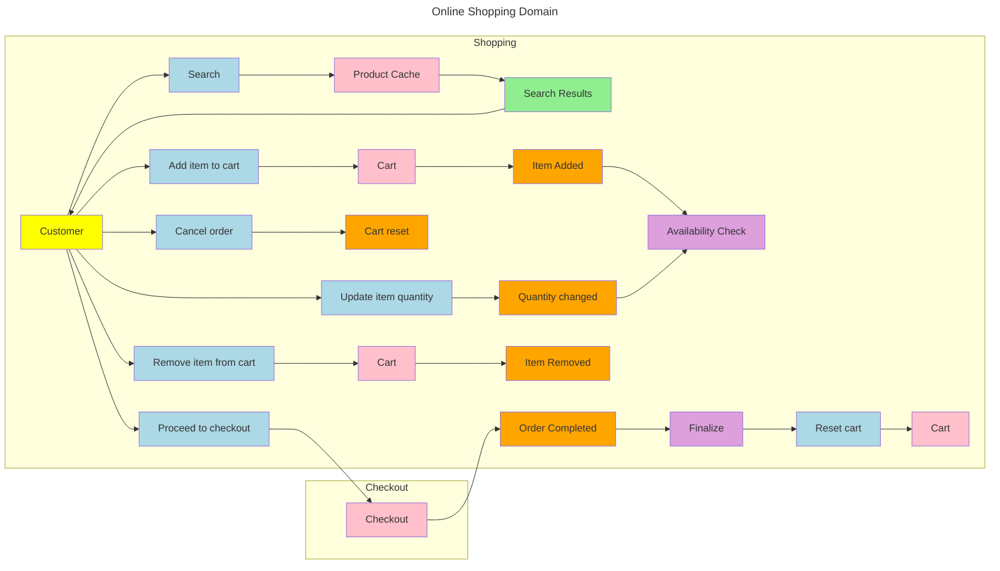

# Shopping Domain

```mermaid
---
title: Online Shopping Domain
---
flowchart LR

    subgraph "Checkout"
        checkout[Checkout]:::system
    end

    subgraph "Shopping"
        Customer:::actor --> Search:::command --> pc[Product Cache]:::system
        pc --> sr[Search Results]:::query
        sr --> Customer

        cmd1[Add item to cart]:::command --> Cart:::system
        Customer --> cmd1
        Cart --> ev1[Item Added]:::event
        ev1 --> p1[Availability Check]:::policy
        Customer --> cmd2[Proceed to checkout]:::command
        cmd2 --> checkout
        checkout --> ev2[Order Completed]:::event
        ev2 --> p2[Finalize]:::policy
        p2 --> cmd3[Reset cart]:::command --> Cart2[Cart]:::system
        Customer --> cmd4[Remove item from cart]:::command --> Cart3[Cart]:::system --> ev3[Item Removed]:::event
        Customer --> cmd5[Cancel order]:::command --> ev4[Cart reset]:::event
        Customer --> cmd6[Update item quantity]:::command --> ev5[Quantity changed]:::event --> p1

    end


    classDef event fill:orange
    classDef command fill:lightblue
    classDef query fill:lightgreen
    classDef system fill:pink
    classDef actor fill:yellow
    classDef policy fill:plum
```